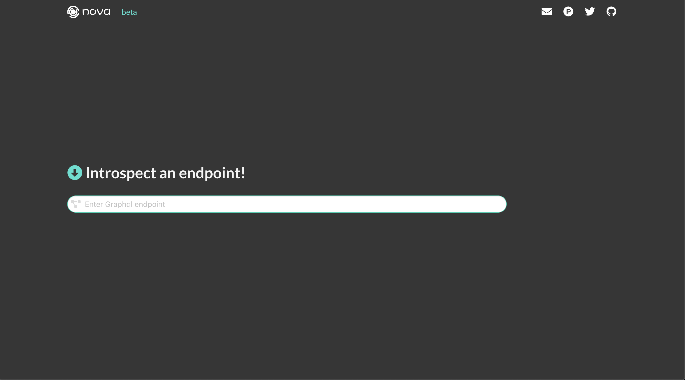
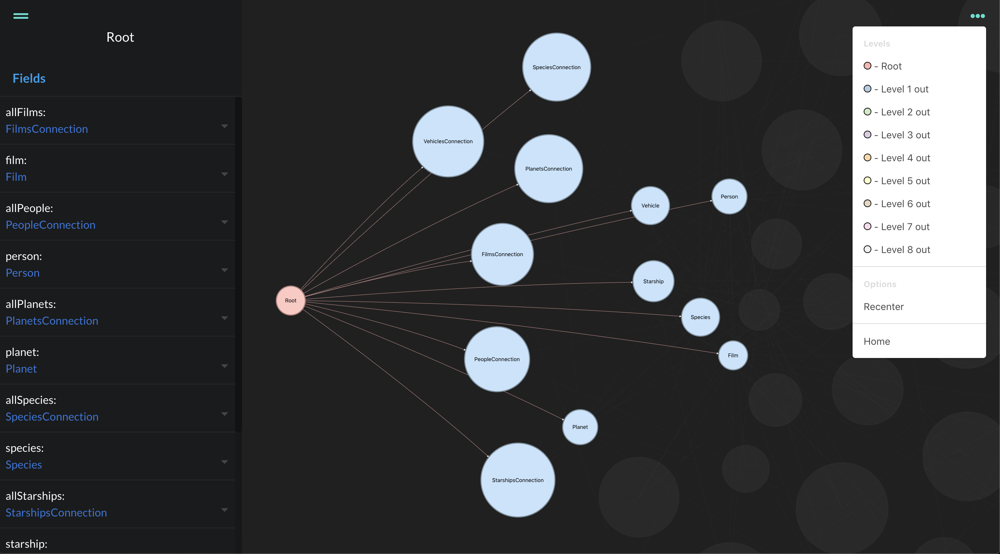

#  Nova
## GraphQL Schema visualizer for developers

## No Longer Used
## Moved to [/nova-introspection/novaql](https://github.com/nova-introspection/novaql)

Front Page                      | Visualizer Page
:------------------------------:|:-------------------------:
 |

### How to use
Head over to [novaql.com](http://novaql.com)            
Just enter a GraphQL endpoint! Nova will create an interactive visualization that represents the schema.

### Built with
 - React
 - React Router
 - D3.js
 - Nodejs
 - Express
 - Babel
 - Webpack

### Contributing
Nova is currently in beta release. We encourage you to submit issues for any bugs or ideas for enhancements. Also feel free to fork this repo and submit pull requests to contribute as well.

### Authors
 - [Jovan Kelly](https://github.com/kellyjovan)
 - [Bo Peng](https://github.com/bopeng95)
 - [Bryan Costa](https://github.com/bryanAcosta)
 - [Brayton Holman](https://github.com/frontleft)

### License
This project is licensed under the MIT License - see the LICENSE.md file for details

